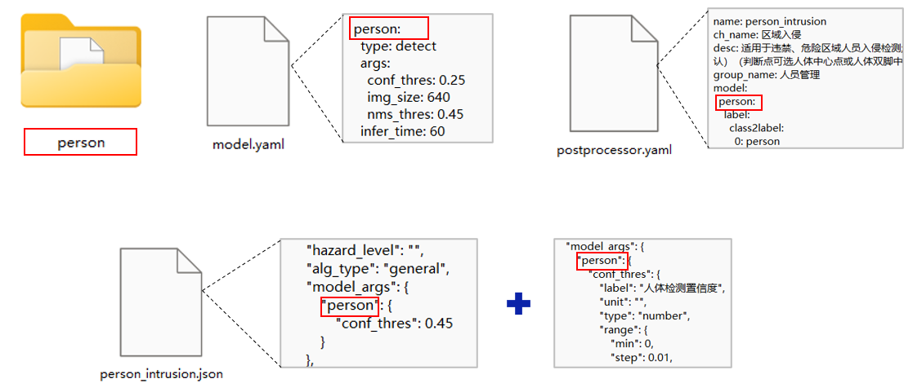
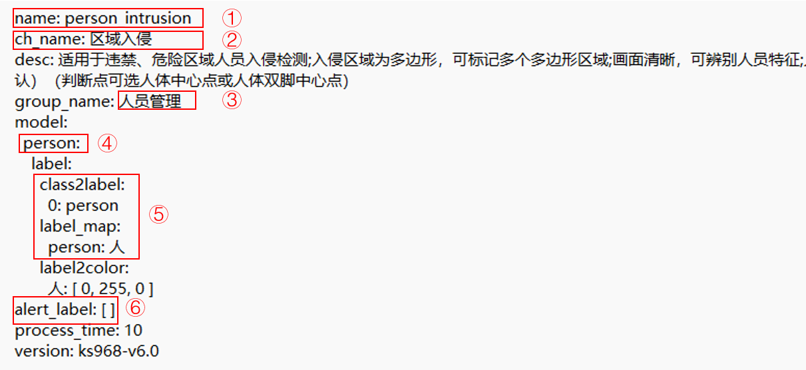

#### 推理模块实例

下图推理模块调用流程图。


主程序循环调用`__init__.py`中的`infer`函数，该函数在每个实例中会被重写。

下图为推理模块流程图。

- **模型初始化：** 加载模型，加载模型配置文件。
- **模型推理：** 读取RGB图像，进行图像缩放、维度变换等预处理，并进行模型推理。
- **结果后处理：** 执行阈值过滤与nms过滤等操作，对低阈值目标，重复目标进行过滤。
- **结果写入：** 推理结果写入redis队列。


以**未穿工服检测算法**为例进行说明。算法使用`yolov5`，检测人员目标，目标检测推理代码`detect.py`如下。

```python
import cv2
import numpy as np

from logger import LOGGER
from model import RknnModel


class Model(RknnModel):
    default_args = {
        'img_size': 640,
        'nms_thres': 0.45,
        'conf_thres': 0.25,
        'anchors': [[10, 13], [16, 30], [33, 23], [30, 61], [62, 45], [59, 119], [116, 90], [156, 198], [373, 326]]
    }

    def __init__(self, acc_id, name, conf):
        super().__init__(acc_id, name, conf, ['model'])

    def __yolov5_post_process(self, input_data):
        masks = [[0, 1, 2], [3, 4, 5], [6, 7, 8]]
        boxes, classes, scores = [], [], []
        for input_, mask in zip(input_data, masks):
            b, c, s = self.__process(input_, mask)
            b, c, s = self.__filter_boxes(b, c, s)
            boxes.append(b)
            classes.append(c)
            scores.append(s)
        boxes = np.concatenate(boxes)
        boxes = self._xywh2xyxy(boxes)
        classes = np.concatenate(classes)
        scores = np.concatenate(scores)
        nboxes, nclasses, nscores = [], [], []
        keep = self._nms_boxes(boxes, scores)
        if len(keep) != 0:
            nboxes.append(boxes[keep])
            nclasses.append(classes[keep])
            nscores.append(scores[keep])
        if not nclasses and not nscores:
            return None, None, None
        return np.concatenate(nboxes), np.concatenate(nclasses), np.concatenate(nscores)

    def __process(self, input_, mask):
        anchors = [self.anchors[i] for i in mask]
        grid_h, grid_w = map(int, input_.shape[0:2])
        box_confidence = input_[..., 4]
        box_confidence = np.expand_dims(box_confidence, axis=-1)
        box_class_probs = input_[..., 5:]
        box_xy = input_[..., :2] * 2 - 0.5
        col = np.tile(np.arange(0, grid_w), grid_w).reshape(-1, grid_w)
        row = np.tile(np.arange(0, grid_h).reshape(-1, 1), grid_h)
        col = col.reshape(grid_h, grid_w, 1, 1).repeat(3, axis=-2)
        row = row.reshape(grid_h, grid_w, 1, 1).repeat(3, axis=-2)
        grid = np.concatenate((col, row), axis=-1)
        box_xy += grid
        box_xy *= int(self.img_size / grid_h)
        box_wh = pow(input_[..., 2:4] * 2, 2)
        box_wh = box_wh * anchors
        return np.concatenate((box_xy, box_wh), axis=-1), box_confidence, box_class_probs

    def __filter_boxes(self, boxes, box_confidences, box_class_probs):
        """
        Filter boxes with box threshold. It's a bit different with origin yolov5 post process!
        Args:
            boxes: ndarray, boxes of objects.
            box_confidences: ndarray, confidences of objects.
            box_class_probs: ndarray, class_probs of objects.
        Returns:
            boxes: ndarray, filtered boxes.
            classes: ndarray, classes for boxes.
            scores: ndarray, scores for boxes.
        """
        boxes = boxes.reshape(-1, 4)
        box_confidences = box_confidences.reshape(-1)
        box_class_probs = box_class_probs.reshape(-1, box_class_probs.shape[-1])
        _box_pos = np.where(box_confidences >= self.conf_thres)
        boxes = boxes[_box_pos]
        box_confidences = box_confidences[_box_pos]
        box_class_probs = box_class_probs[_box_pos]
        class_max_score = np.max(box_class_probs, axis=-1)
        classes = np.argmax(box_class_probs, axis=-1)
        _class_pos = np.where(class_max_score >= self.conf_thres)
        return boxes[_class_pos], classes[_class_pos], (class_max_score * box_confidences)[_class_pos]

    def _load_args(self, args):
        try:
            self.img_size = args.get('img_size', self.default_args['img_size'])
            self.nms_thres = args.get('nms_thres', self.default_args['nms_thres'])
            self.conf_thres = args.get('conf_thres', self.default_args['conf_thres'])
            self.anchors = args.get('anchors', self.default_args['anchors'])
        except:
            LOGGER.exception('_load_args')
            return False
        return True

    def infer(self, data, **kwargs):
        """
        目标检测
        Args:
            data: 图像数据，ndarray类型，RGB格式（BGR格式需转换）
        Returns: infer_result
        """
        infer_result = []
        if self.status:
            try:
                image = data
                scale = 1
                raw_width, raw_height = image.shape[1], image.shape[0]
                if max(image.shape[:2]) != self.img_size:
                    scale = self.img_size / max(image.shape[:2])
                    if raw_height > raw_width:
                        image = cv2.resize(image, (int(raw_width * scale), self.img_size))
                    else:
                        image = cv2.resize(image, (self.img_size, int(raw_height * scale)))
                image, dw, dh = self._letterbox(image, (self.img_size, self.img_size))
                image = np.expand_dims(image, axis=0)
                outputs = self._rknn_infer('model', [image])
                input0_data = outputs[0].reshape([3, -1] + list(outputs[0].shape[-2:]))
                input1_data = outputs[1].reshape([3, -1] + list(outputs[1].shape[-2:]))
                input2_data = outputs[2].reshape([3, -1] + list(outputs[2].shape[-2:]))
                input_data = list()
                input_data.append(np.transpose(input0_data, (2, 3, 0, 1)))
                input_data.append(np.transpose(input1_data, (2, 3, 0, 1)))
                input_data.append(np.transpose(input2_data, (2, 3, 0, 1)))
                boxes, classes, scores = self.__yolov5_post_process(input_data)
                if boxes is not None:
                    for i, box in enumerate(boxes):
                        obj = {
                            'label': int(classes[i]),
                            'conf': round(float(scores[i]), 2)
                        }
                        xyxy = [int(box[0] - dw), int(box[1] - dh), int(box[2] - dw), int(box[3] - dh)]
                        if scale != 1:
                            xyxy = [int(x / scale) for x in xyxy]
                        obj['xyxy'] = [xyxy[0] if xyxy[0] >= 0 else 0,
                                       xyxy[1] if xyxy[1] >= 0 else 0,
                                       xyxy[2] if xyxy[2] <= raw_width else raw_width,
                                       xyxy[3] if xyxy[3] <= raw_height else raw_height]
                        infer_result.append(obj)
            except:
                LOGGER.exception('infer')
        return infer_result
```

**核心函数：infer**

###### 函数输入

- `data：`RGB图像数据
- `**kwargs：`用户自定义k-v参数对

###### 函数输出

- `infer_result`，格式如下。

```python
[
    {
        "conf": 0.38,
        "label": 0,
        "xyxy": [314, 93, 435, 142]
    }, {
        "conf": 0.36,
        "label": 0,
        "xyxy": [538, 258, 553, 269]
    }
]
```

###### 处理过程

- `self._letterbox():` 对输入图像进行填充缩放。
- `self._rknn_infer():` rknn模型推理。
- `self.__yolov5_post_process():` 对rknn推理结果进行目标框、类别、置信度解码；过滤低置信度目标；非极大值抑制去除冗余目标。

#### 后处理模块实例

下图为后处理模块调用流程图。


主程序循环调用`__init__.py`中的`postprocess`函数，该函数会调用每个后处理实例中的`__process`函数。

下图为后处理模块流程图。

- **初始化：** 后处理的输入参数与输出结果初始化。
- **后处理：** 过滤非标签目标，过滤低置信度目标，特征比对，告警业务逻辑编写。
- **结果写入：** 结果写入告警队列。


`未穿工服检测`后处理代码`work_clothes.py`如下。

```python
import numpy as np

import gv
from logger import LOGGER
from postprocessor import Postprocessor as BasePostprocessor
from .utils import json_utils
from .utils.cv_utils.color_utils import rgb_reverse
from .utils.cv_utils.crop_utils import crop_rectangle
from .utils.image_utils import base64_to_opencv, opencv_to_base64


class Postprocessor(BasePostprocessor):
    def __init__(self, source_id, alg_name):
        super().__init__(source_id, alg_name)
        self.person_model_name = 'person'
        self.workclothes_model_name = 'work_clothes'
        self.index = None
        self.group_type = None
        self.similarity = None
        self.limit = None
        self.timeout = None
        self.reinfer_result = {}
        self.distance_th = 10

    def __reinfer(self, filter_result):
        person_rectangles = filter_result.get(self.person_model_name)
        if person_rectangles is None:
            LOGGER.error('Person model result is None!')
            return False
        person_rectangles = sorted(person_rectangles, key=lambda x: x['conf'], reverse=True)
        draw_image = base64_to_opencv(self.draw_image)
        image_height, image_width, _ = draw_image.shape
        count = 0
        for person_rectangle in person_rectangles:
            if count >= self.limit:
                break
            xyxy = person_rectangle['xyxy']
            if xyxy[0] < self.distance_th or \
                    xyxy[2] > image_width - self.distance_th or \
                    xyxy[3] > image_height - self.distance_th:
                continue
            cropped_image = crop_rectangle(draw_image, xyxy)
            cropped_image = rgb_reverse(cropped_image)
            source_data = {
                'source_id': self.source_id,
                'time': self.time * 1000000,
                'infer_image': opencv_to_base64(cropped_image),
                'draw_image': None,
                'reserved_data': {
                    'specified_model': [self.workclothes_model_name],
                    'xyxy': xyxy,
                    'unsort': True
                }
            }
            self.rq_source.put(json_utils.dumps(source_data))
            count += 1
        if count > 0:
            self.reinfer_result[self.time] = {
                'count': count,
                'draw_image': self.draw_image,
                'result': []
            }
        return count

    def __check_expire(self):
        for time in list(self.reinfer_result.keys()):
            if time < self.time - self.timeout:
                LOGGER.warning('Reinfer result expired, source_id={}, alg_name={}, time={}, timeout={}'.format(
                    self.source_id, self.alg_name, time, self.timeout))
                del self.reinfer_result[time]
        return True

    def __process_blacklist(self, feature):
        id_, score = self.index.search(feature, self.similarity) if self.index is not None else (None, None)
        if id_ is not None:
            work_clothes_info = self.index.query(id_)
            if work_clothes_info:
                return True, work_clothes_info['name']
        return False, '人'

    def __process_whitelist(self, feature):
        id_, score = self.index.search(feature, self.similarity) if self.index is not None else (None, None)
        if id_ is not None:
            work_clothes_info = self.index.query(id_)
            if work_clothes_info:
                return False, work_clothes_info['name']
        return True, '未穿工服'

    def _process(self, result, filter_result):
        hit = False
        if self.index is None:
            self.index = gv.index_dic.get(self.reserved_args['group_id'])
        if self.group_type is None:
            self.group_type = self.reserved_args['group_type']
        if self.similarity is None:
            self.similarity = max(self.reserved_args['similarity'] - 0.3, 0)
        if self.limit is None:
            self.limit = self.reserved_args['extra_model'][self.workclothes_model_name]
        if self.timeout is None:
            self.timeout = (self.frame_interval / 1000) * 2
            LOGGER.info('source_id={}, alg_name={}, timeout={}'.format(self.source_id, self.alg_name, self.timeout))
        polygons = self._gen_polygons()
        if not self.reserved_data:
            count = self.__reinfer(filter_result)
            if not count:
                self.__check_expire()
                result['hit'] = False
                result['data']['bbox']['polygons'].update(polygons)
                return True
            return False
        self.__check_expire()
        model_name, targets = next(iter(filter_result.items()))
        if model_name != self.workclothes_model_name:
            LOGGER.error('Get wrong model result, expect {}, but get {}'.format(
                self.workclothes_model_name, model_name))
            return False
        if self.reinfer_result.get(self.time) is None:
            LOGGER.warning('Not found reinfer result, time={}'.format(self.time))
            return False
        self.reinfer_result[self.time]['result'].append((targets, self.reserved_data['xyxy']))
        if len(self.reinfer_result[self.time]['result']) < self.reinfer_result[self.time]['count']:
            return False
        reinfer_result_ = self.reinfer_result.pop(self.time)
        self.draw_image = reinfer_result_['draw_image']
        for targets, xyxy in reinfer_result_['result']:
            for target in targets:
                feature = target.pop('feature', None)
                if feature is not None:
                    np_feature = np.array(feature, dtype=np.float32)
                    if 'blacklist' == self.group_type:
                        hit_, label = self.__process_blacklist(np_feature)
                    elif 'whitelist' == self.group_type:
                        hit_, label = self.__process_whitelist(np_feature)
                    else:
                        LOGGER.error('Unknown group_type: {}'.format(self.group_type))
                        continue
                    if hit_:
                        hit = hit_
                        result['data']['bbox']['rectangles'].append(self._gen_rectangle(
                            xyxy, self.alert_color, label, None))
                    else:
                        result['data']['bbox']['rectangles'].append(self._gen_rectangle(
                            xyxy, self.non_alert_color, label, None))
        result['hit'] = hit
        result['data']['group'] = {
            'id': self.index.group_id if self.index is not None else None,
            'name': self.index.group_name if self.index is not None else None
        }
        result['data']['bbox']['polygons'].update(polygons)
        return True

    def _filter(self, model_name, model_data):
        targets = []
        if model_name == self.workclothes_model_name and not self.reserved_data:
            return targets
        model_conf = model_data['model_conf']
        engine_result = model_data['engine_result']
        if model_name == self.person_model_name:
            for engine_result_ in engine_result:
                # 过滤掉置信度低于阈值的目标
                if not self._filter_by_conf(model_conf, engine_result_['conf']):
                    continue
                # 过滤掉不在label列表中的目标
                label = self._filter_by_label(model_conf, engine_result_['label'])
                if not label:
                    continue
                # 坐标缩放
                xyxy = self._scale(engine_result_['xyxy'])
                # 过滤掉不在多边形内的目标
                if not self._filter_by_roi(xyxy):
                    continue
                # 生成矩形框
                targets.append(self._gen_rectangle(xyxy, self.non_alert_color, label, engine_result_['conf']))
        elif model_name == self.workclothes_model_name:
            targets.append({
                'feature': engine_result
            })
        return targets

```

**核心函数：__process**

###### 函数输入

- `result：`结果字典。包括是否命中`hit`，以及告警结果数据`data`。若后处理产生告警，则`hit`为`true`，否则为`false`。`data`中，`rectangles`为目标框数据，`polygons`为多边形检测区域数据，`lines`为虚拟直线数据，在人员计数等算法中使用。`custom`为用户自定义的数据。
- `group`为底库组，`id`为组id，`name`为组名字。

```json
{
	"hit": true,
	"data": {
		"bbox": {
			"rectangles": [{
				"xyxy": [1066, 124, 1164, 270],
				"color": [0, 0, 255],
				"label": "未穿工服",
				"conf": "None",
				"ext": {}
			}],
			"polygons": {
				"polygon_073c09e1-515e-47c9-89e0-52fa69811b46": {
					"name": "",
					"polygon": [
						[1, 715],
						[6, 1],
						[1273, 6],
						[1275, 716]
					],
					"color": [255, 0, 0],
					"ext": {}
				}
			},
			"lines": {}
		},
		"custom": {},
		"group": {
			"id": "675801d85dc58a0a16073339",
			"name": "红色工服底库"
		}
	}
}
```

- `filter_result`：标签过滤以及低置信度过滤后的结果。`person`指的是模型名称，后面的值是模型的推理结果list。
- 第一次推理，人体检测的`filter_result`。

```json
{
	"work_clothes": [],
	"person": [{
		"xyxy": [1066, 124, 1164, 268],
		"color": [0, 255, 0],
		"label": "person",
		"conf": 0.9,
		"ext": {}
	}]
}
```

- 第二次推理，特征提取的`filter_result`。`feature`为512维工服特征。

```json
{
	"work_clothes": [{
		"feature": [-0.08117731660604477, 0.0363161638379097,...]
	}]
}
```

###### 函数输出

`True` or `False`

#### 算法包配置文件修改

- 算法名称修改为自己定义的算法名称，如：custom_person_intrusion，若不修改，会覆盖已有算法文件


- 模型名称修改为自定义的算法名称，如：custom_person，若不修改，会覆盖已有模型。将量化好的模型放置下图第一个文件夹下



- 推理代码文件名称修改：在`区域入侵`算法中，推理代码文件为`detect.py`，将此文件名称修改为`custom_detect.py`。

- `model.yaml`文件修改：`model.yaml`中的①为模型名称，即模型文件夹名称；②为检测类型，与推理代码文件名称一致。


- `postprocessor.yaml`文件修改：①处为算法名称，②处为算法中文名，③为算法分组名称，④为模型名称，⑤为label映射，⑥为告警label，矩形框上的告警label，可自行自定义，若不写，使用label_map中的value



- 前端配置文件xxx.json修改：详细可参照[前端配置文件](../../JSON.md)。修改`model_args`中的模型文件名。


#### 算法包加密

- 将算法包加密为bin文件。下载算法包[加密工具](https://pan.baidu.com/s/173r6sLMh77n3JrKkLnSpYg?pwd=0000)。将待加密算法包放在文件夹内（文件夹只含单个算法包），填写待加密算法包的上级路径（如下述文件夹所示），点击【确定】按钮，提示即将加密的算法包名称，点击【ok】；


- 加密完成的bin文件为最终文件，从盒子后台管理系统【算法仓库】中导入即可。